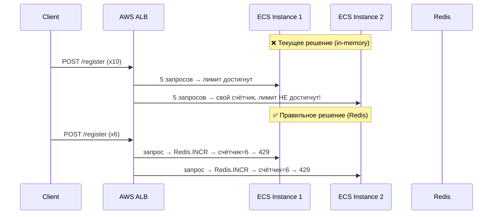

**[ТРЕБУЕТ ПРАВОК]**

Код рабочий, но содержит **4 нарушения** требований проекта: захардкоженные origins вместо конфига, in-memory Rate Limiter вместо Redis, отсутствие `Recoverer`-middleware и незащищённый Swagger в production.

---

### 📋 Чек-лист соответствия (Project Compliance)

**FRD:** `PASS` — Роуты `/register` и `/login` соответствуют Epic 1 (Task 1.2). Swagger присутствует (API-First).

**Architecture:** `FAIL` — Нарушено требование:
> *"Redis используется для жесткого Rate Limiting API (алгоритм Token Bucket), чтобы защититься от Thundering Herd problem и брутфорса"* — `architecture.md, п.4`

Текущий `httprate.LimitByIP` — **in-memory**, не Redis. При горизонтальном масштабировании (2+ ECS Fargate контейнера) каждый инстанс будет иметь свой счётчик, и лимит фактически умножится на количество реплик. Защита от брутфорса сломана.

**Plan:** `FAIL` — Нарушено требование Task 0.4:
> *"RateLimiter (на базе Redis для защиты от Thundering Herd)"* — `plan.md, Epic 0, Task 0.4`

Также нарушено: `AllowedOrigins` захардкожены, хотя в `config.go` уже существует поле `Api.AllowedOrigins []string` — конфиг не используется.

---

### 🏗️ Архитектурный разбор и Критика

#### Проблема 1 — In-Memory Rate Limiter (КРИТИЧНО для production)
`httprate.LimitByIP` хранит счётчики в памяти процесса. На AWS ECS Fargate с 2+ репликами это означает, что атакующий может делать `5 * N_replicas` запросов в минуту. Redis-based лимитер решает это централизованно.

#### Проблема 2 — Захардкоженные CORS Origins
`config.go` уже содержит `Api.AllowedOrigins []string`, но роутер его игнорирует. Это нарушает принцип единого источника истины (Single Source of Truth) и усложняет деплой в разных окружениях (staging vs production).

#### Проблема 3 — Отсутствие `Recoverer`
Паника в любом хендлере убьёт весь Go-процесс. `chi/middleware.Recoverer` — обязательный минимум для production.

#### Проблема 4 — Swagger без защиты
`/swagger/*` открыт для всех. В production это раскрывает полный API-контракт. Необходима защита через env-флаг или Basic Auth.

#### Проблема 5 — Trailing slash в `/api/v1/`
`r.Route("/api/v1/", ...)` — chi чувствителен к trailing slash. Запрос на `/api/v1/users/register` может не матчиться. Правильно: `/api/v1`.

#### Проблема 6 — Отсутствие `/health` эндпоинта
AWS ALB и ECS требуют health-check эндпоинт для определения готовности контейнера. Без него деплой ненадёжен.



---

### 🎫 Задачи (GitHub Project Tickets)

**[Refactor] Перевести Rate Limiter на Redis**
- Заменить `httprate.LimitByIP` на Redis-based реализацию (например, `go-redis/redis_rate` или кастомный middleware через `pkg/redis`)
- Лимитер должен принимать `*redis.Client` через DI
- AC: При 2 запущенных инстансах суммарный лимит не превышает 5 req/min с одного IP

**[Refactor] Читать CORS origins из конфига**
- Передавать `*config.Config` в `RegisterRoutes`
- Использовать `cfg.Api.AllowedOrigins` в `cors.Options`
- AC: Смена origins через `.env` без перекомпиляции

**[Feature] Добавить `/health` и `/ready` эндпоинты**
- `GET /health` — возвращает `200 OK` (liveness)
- `GET /ready` — проверяет коннект к PostgreSQL и Redis (readiness)
- AC: AWS ALB health-check проходит успешно

**[Bug] Убрать trailing slash из `/api/v1/`**
- Заменить `"/api/v1/"` на `"/api/v1"`
- AC: `POST /api/v1/users/register` возвращает не 404

**[Feature] Защитить Swagger в production**
- Добавить env-флаг `SWAGGER_ENABLED=true/false`
- Регистрировать `/swagger/*` только если флаг `true`
- AC: В production-окружении `/swagger/*` возвращает 404

---

### 💻 Решение

```go
package handler

import (
	"net/http"
	"os"
	"time"

	"github.com/go-chi/chi/v5"
	chiMiddleware "github.com/go-chi/chi/v5/middleware"
	"github.com/go-chi/cors"
	httpSwagger "github.com/swaggo/http-swagger/v2"

	"synaply/internal/config"
	"synaply/internal/middleware"
)

// RegisterRoutes инициализирует роутер.
// cfg передаётся для чтения AllowedOrigins и флага Swagger из конфига (Single Source of Truth).
// redisLimiter — Redis-based middleware для rate limiting (защита от брутфорса на уровне кластера).
func RegisterRoutes(h *Handler, cfg *config.Config, redisLimiter func(http.Handler) http.Handler) *chi.Mux {
	r := chi.NewRouter()

	// --- Глобальные middleware (порядок важен) ---

	// 1. Recoverer: перехватывает паники, не даёт упасть всему процессу
	r.Use(chiMiddleware.Recoverer)

	// 2. CORS: origins берём из конфига, не хардкодим
	r.Use(cors.Handler(cors.Options{
		AllowedOrigins:   cfg.Api.AllowedOrigins,
		AllowedMethods:   []string{"GET", "POST", "PUT", "DELETE", "OPTIONS"},
		AllowedHeaders:   []string{"Accept", "Authorization", "Content-Type", "X-CSRF-Token"},
		ExposedHeaders:   []string{"Link"},
		AllowCredentials: true,
		MaxAge:           300,
	}))

	// 3. Кастомные middleware проекта
	r.Use(middleware.LoggerMiddleware)
	r.Use(middleware.LimitPayloadSize)

	// --- Health-check эндпоинты (вне /api/v1, без auth) ---
	// Используются AWS ALB для liveness/readiness проб.
	r.Get("/health", func(w http.ResponseWriter, r *http.Request) {
		w.WriteHeader(http.StatusOK)
	})
	r.Get("/ready", h.ReadinessCheck) // проверяет DB + Redis

	// --- Swagger: только если явно включён через env ---
	// В production SWAGGER_ENABLED должен быть "false" или отсутствовать.
	if os.Getenv("SWAGGER_ENABLED") == "true" {
		r.Get("/swagger/*", httpSwagger.WrapHandler)
	}

	// --- API v1 ---
	r.Route("/api/v1", func(r chi.Router) {

		// Публичные роуты аутентификации.
		// Rate Limiting через Redis (централизованный счётчик для всех реплик ECS).
		// architecture.md: "Redis используется для жесткого Rate Limiting API"
		r.Route("/users", func(r chi.Router) {
			r.Use(redisLimiter) // 5 req/min per IP, счётчик в Redis
			r.Post("/register", h.Register)
			r.Post("/login", h.Login)
		})

	})

	return r
}
```

#### Пример Redis Rate Limiter middleware (`internal/middleware/rate_limiter.go`)

```go
package middleware

import (
	"context"
	"fmt"
	"net/http"
	"time"

	"github.com/redis/go-redis/v9"
)

// NewRedisRateLimiter возвращает middleware, ограничивающий запросы по IP через Redis.
// Алгоритм: Fixed Window Counter (достаточно для MVP, легко заменить на Token Bucket).
// architecture.md: "алгоритм Token Bucket" — для v2 заменить на redis_rate.NewGcraLimiter.
func NewRedisRateLimiter(rdb *redis.Client, limit int, window time.Duration) func(http.Handler) http.Handler {
	return func(next http.Handler) http.Handler {
		return http.HandlerFunc(func(w http.ResponseWriter, r *http.Request) {
			ip := r.RemoteAddr // в production: X-Forwarded-For через Cloudflare/ALB
			key := fmt.Sprintf("rate_limit:%s", ip)

			ctx := context.Background()

			count, err := rdb.Incr(ctx, key).Result()
			if err != nil {
				// Graceful Degradation: при недоступности Redis пропускаем запрос,
				// не блокируем пользователей из-за инфраструктурного сбоя.
				next.ServeHTTP(w, r)
				return
			}

			if count == 1 {
				// Устанавливаем TTL только при первом инкременте
				rdb.Expire(ctx, key, window)
			}

			if int(count) > limit {
				w.Header().Set("Retry-After", fmt.Sprintf("%.0f", window.Seconds()))
				http.Error(w, `{"error":"rate limit exceeded"}`, http.StatusTooManyRequests)
				return
			}

			next.ServeHTTP(w, r)
		})
	}
}
```

#### Инициализация в `main.go` / `server.go`

```go
// Пример подключения в точке сборки (Composition Root)
redisLimiter := middleware.NewRedisRateLimiter(redisClient, 5, 1*time.Minute)
router := handler.RegisterRoutes(h, cfg, redisLimiter)
```

---

### 🚀 Следующий шаг

Согласно `plan.md`, **Task 1.2 (Epic 1)** — интеграция **Feide SSO (OIDC)**. Это абсолютный блокер для B2G-рынка.

После мержа правок роутера следующий шаг:
1. Добавить роут `GET /api/v1/auth/feide/callback` в `RegisterRoutes`
2. Реализовать OIDC-клиент в `internal/auth/` (пакет `coreos/go-oidc/v3`)
3. После успешного Feide-колбека — выдавать внутренний JWT (Task 1.2)
