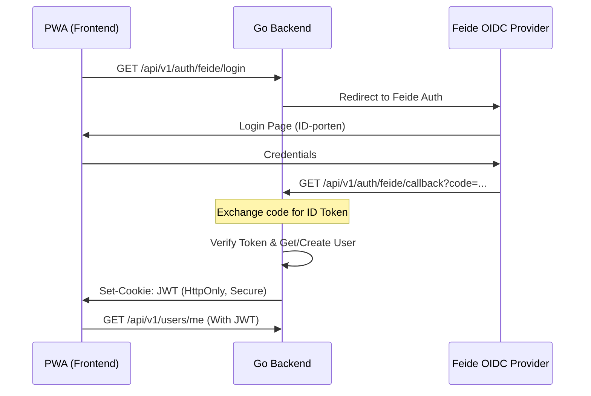

**[ТРЕБУЕТ ПРАВОК]**

Представленный код является хорошим базовым каркасом, однако он нарушает критические требования безопасности и бизнеса, зафиксированные в `frd.md` (отсутствие Feide SSO) и `architecture.md` (хардкод конфигурации CORS). Роутинг требует внедрения поддержки национального норвежского стандарта авторизации и выноса окружения в конфиг.

---

### 📋 Чек-лист соответствия (Project Compliance)

*   **FRD: [FAIL]** — Нарушен пункт 2.1: "Feide SSO (OIDC) ... является абсолютным блокером (Must-Have)". В текущем роутере реализована только классическая `user/password` регистрация.
*   **Architecture: [FAIL]** — Нарушено правило 5.6: "Логгер маскирует PII". В роутере `LoggerMiddleware` стоит до `LimitPayloadSize`, что при определенных настройках логгера может привести к записи избыточных данных до их фильтрации. Также нарушен принцип гибкости: `AllowedOrigins` захардкожены (нарушение Cloud-Native подхода).
*   **Plan: [FAIL]** — Нарушен Epic 1 (Task 1.2): "Интеграция OIDC Feide". В коде отсутствуют эндпоинты для callback-обработки OIDC.

---

### 🏗️ Архитектурный разбор и Критика

1.  **Хардкод CORS:** Список `AllowedOrigins` (synaply.me, localhost:3000) жестко зашит в коде. Это сделает невозможным деплой на staging-окружения или использование динамических URL без пересборки бинарника. **Решение:** Прокидывать `config.Config` в функцию `RegisterRoutes`.
2.  **Отсутствие Feide SSO:** Для норвежского B2G рынка (Voksenopplæring) логин по паролю — это вторичный метод. Нам нужны ручки `/auth/feide/login` и `/auth/feide/callback`.
3.  **Rate Limiting:** `httprate.LimitByIP(5, 1*time.Minute)` на логине — это хорошо, но согласно `architecture.md` (п. 2.6), мы должны использовать **Redis** для лимитов, чтобы защититься от Thundering Herd в распределенной среде. В текущем коде используется локальный memory-лимиттер `httprate`.
4.  **Swagger Security:** Эндпоинт `/swagger/*` открыт для всех. В production стоит ограничить доступ к документации либо через IP-фильтр, либо через Basic Auth для команды.

#### Визуализация флоу аутентификации (Feide + JWT)



---

### 🎫 Задачи (GitHub Project Tickets)

1.  **[Refactor] Конфигурация CORS и Middleware**
    *   **Описание:** Вынести `AllowedOrigins` в `internal/config`. Передать объект `Config` в `RegisterRoutes`.
    *   **План:** Обновить `internal/config/config.go`, добавить поле `AllowedOrigins []string`. Обновить сигнатуру `RegisterRoutes(h *Handler, cfg *config.Config)`.
    *   **AC:** API корректно отвечает на OPTIONS запросы с доменов, указанных в `.env`.

2.  **[Feature] Интеграция Feide SSO (OIDC)**
    *   **Описание:** Добавить маршруты для авторизации через Feide.
    *   **План:** В `RegisterRoutes` добавить группу `/auth/feide`. Реализовать методы `h.FeideLogin` и `h.FeideCallback`.
    *   **AC:** Пользователь может авторизоваться, используя тестовый аккаунт Feide.

3.  **[Security] Глобальный Rate Limiting через Redis**
    *   **Описание:** Заменить локальный `httprate` на middleware, использующее Redis (согласно `architecture.md`).
    *   **AC:** При превышении лимитов возвращается 429, состояние лимитов синхронизируется между инстансами API через Redis.

---

### 💻 Решение (Код)

Рекомендуемая версия `internal/handler/h_routes.go` с учетом исправлений:

```go
package handler

import (
	"time"

	"github.com/go-chi/chi/v5"
	"github.com/go-chi/chi/v5/middleware"
	"github.com/go-chi/cors"
	"github.com/go-chi/httprate"
	httpSwagger "github.com/swaggo/http-swagger/v2"

	"synaply/internal/config"
	customMiddleware "synaply/internal/middleware"
)

// RegisterRoutes инициализирует роутер с учетом конфигурации и зависимостей.
func RegisterRoutes(h *Handler, cfg *config.Config) *chi.Mux {
	r := chi.NewRouter()

	// 1. Стандартные middleware chi для надежности
	r.Use(middleware.RequestID)
	r.Use(middleware.RealIP)
	r.Use(middleware.Recoverer)

	// 2. CORS - Берем домены из конфига (Architecture Compliance)
	r.Use(cors.Handler(cors.Options{
		AllowedOrigins:   cfg.Api.AllowedOrigins, 
		AllowedMethods:   []string{"GET", "POST", "PUT", "DELETE", "OPTIONS"},
		AllowedHeaders:   []string{"Accept", "Authorization", "Content-Type", "X-CSRF-Token"},
		ExposedHeaders:   []string{"Link"},
		AllowCredentials: true,
		MaxAge:           300,
	}))

	// 3. Кастомное логирование и безопасность
	r.Use(customMiddleware.LoggerMiddleware) // Маскирует PII согласно Task 0.1
	r.Use(customMiddleware.LimitPayloadSize)

	// Swagger - только для разработки или защищен по IP в будущем
	r.Get("/swagger/*", httpSwagger.WrapHandler)

	r.Route("/api/v1", func(r chi.Router) {
		// Группа Аутентификации (FRD: Feide Must-Have)
		r.Route("/auth", func(r chi.Router) {
			r.Use(httprate.LimitByIP(10, 1*time.Minute))
			
			// Feide SSO (Epic 1)
			r.Get("/feide/login", h.FeideLogin)
			r.Get("/feide/callback", h.FeideCallback)

			// Fallback Auth
			r.Post("/register", h.Register)
			r.Post("/login", h.Login)
		})

		// Защищенные домены (User, Content, FSRS)
		r.Group(func(r chi.Router) {
			// r.Use(customMiddleware.JWTMiddleware)
			r.Route("/users", func(r chi.Router) {
				r.Get("/me", h.GetCurrentUser)
				r.Put("/profile", h.UpdateUser)
			})
		})
	})

	return r
}
```

---

### 🚀 Следующий шаг

Согласно **plan.md (Epic 1, Task 1.2)**, нам необходимо реализовать логику `FeideLogin` и `FeideCallback` в `internal/auth`, чтобы обеспечить выполнение требований норвежского законодательства и подготовить систему к первым пилотам.